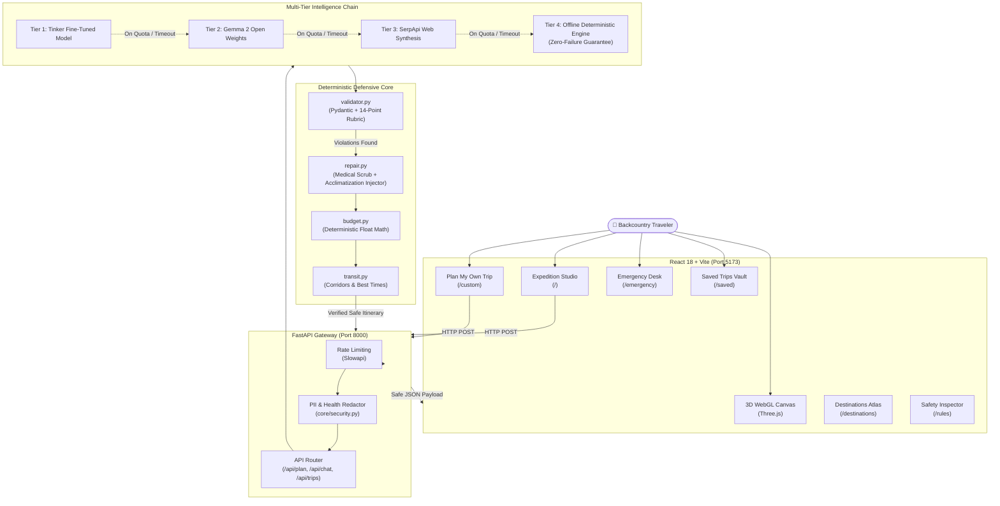

# 🏔️ TrailKit: Defensive AI Trip Planner & Field Safety Copilot

<div align="center">

[](https://fastapi.tiangolo.com)
[](https://python.org)
[](https://react.dev)
[](https://vitejs.dev)
[](https://threejs.org)
[](https://tailwindcss.com)
[](https://docs.pytest.org)
[](https://www.docker.com)
[](LICENSE)

**Hugging Face Weekend Hackathon 2026** · `#hf26challenge` · `#devchallenge` · `#weekendchallenge`  
**Theme:** *Build for a Friend* (Built for friends & families venturing into high-altitude treks and rugged outdoors where safety cannot be left to an LLM's imagination).

[Explore Live Demo](http://localhost:5173) · [API Documentation](http://localhost:8000/docs) · [Architecture Spec](#-system-architecture) · [Safety Rubric](#-the-14-point-zero-harm-safety-rubric)

</div>

---

## 🌟 Overview: Why TrailKit?

When planning extreme outdoor adventures (Ladakh, Spiti Valley, Sikkim Himalayas, high-altitude passes > 15,000 ft), standard LLMs pose dangerous real-world hazards:
- **Hallucinating Prescription Dosages**: Suggesting high-risk pharmaceuticals (e.g. Diamox / Acetazolamide) without medical supervision or proper contraindication screening.
- **Ignoring High-Altitude Physiology**: Planning ascents of >3,500m on Day 1 without mandatory acclimatization days, risking Acute Mountain Sickness (AMS), HAPE, or HACE.
- **Suggesting Impossible Mountain Travel Times**: Assuming flat-highway speeds on rugged dirt tracks and mountain passes subject to afternoon flash floods, mudslides, and early closure windows.
- **Hallucinated Financial Calculations**: Making basic arithmetic mistakes on group gear budgets, per-person splits, and buffer reserves.
- **Neglecting Minors & Toddlers**: Scheduling technical climbs, glacial traverses, or remote bivouacs for families with toddlers or young children.

### 🛡️ The TrailKit Paradigm: Code-Enforced Defensive AI
> **"The AI proposes creative itineraries; deterministic Python code strictly validates and repairs human safety."**

TrailKit combines open-weight intelligence (Gemma / Tinker fine-tuning) with a **14-Point Deterministic Safety Rubric**. If the AI hallucinates a prescription drug, omits a rest day, or under-allocates emergency gear, the **Deterministic Repair Engine** catches the violation, scrubs the hazard, injects required protocols, and delivers a medically and physiologically safe expedition plan.

---

## 🚀 Key Features

### 1. 🎮 Real-time 3D WebGL Backcountry Canvas
- Custom **Three.js low-poly mountain landscape** with atmospheric depth, procedural terrain vertices, and dynamic sun/shadow lighting.
- **Interactive Destination HUD**: Smooth cinematic camera flight transitions when switching destinations (Leh Ladakh, Spiti Valley, Meghalaya, Sikkim, Western Ghats).
- **Soundwave Visualizer**: Embedded audio frequency visualizer synced to ambient field acoustics and safety briefings.

### 2. 🗺️ Multi-Page Expedition Portal
- 🧭 **Expedition Studio (`/`)**: AI-assisted one-click expedition generation with real-time defensive validation, gear checklists, budget breakdown, and altitude elevation profile.
- ✏️ **Plan My Own Trip (`/custom`)**: Fully custom expedition builder:
  - **Manual Stop & Place Entry**: Add custom waypoints or choose from curated regional landmark suggestions.
  - **Custom Waypoint Reordering**: Sequence your stops with instant elevation tracking.
  - **Health & Party Profile**: Configure travel party age demographics (infants, seniors) and medical conditions (asthma, hypertension).
  - **Live Defensive Validation**: Real-time feedback displaying safety alerts before you hit the trail.
- ⏱️ **Best Visiting Times & Smart Transit Corridors**:
  - **Landmark Opening Hours**: Accurate morning/golden-hour visiting windows for monasteries, lakes, and viewpoints.
  - **Pass Closure Warning Windows**: Real-time high-pass transit corridors (e.g., Khardung La afternoon freeze warnings, Rohtang Pass Tuesday closures, Kunzum Pass 14:00 cutoff).
  - **Least-Travel-Time Route Optimization**: Intelligently routes through the **Agham-Shyok corridor** (saving 4.5 hours between Nubra and Pangong), the **Atal Tunnel bypass** (saving 3.5 hours), and optimized Spiti loop directions.
- 🏔️ **Destinations Atlas (`/destinations`)**: Curated regional backcountry guides with max altitudes, optimal seasons, terrain ratings, and 1-click itinerary population.
- 🚨 **Emergency & Evacuation Desk (`/emergency`)**:
  - Instant offline triage checklist for AMS, HAPE, and hypothermia.
  - GPS SOS transmitter & coordinate broadcaster.
  - Satellite communicator (Garmin inReach / ZOLEO) field instructions.
  - Verified regional emergency dispatch helplines (ITBP, Army Medical Corps, BRO, District Police).
- 💾 **Saved Expeditions (`/saved`)**: Saved trips vault synced across LocalStorage and backend storage with **1-click Markdown and JSON offline export**.
- 🛡️ **Safety Rules Inspector (`/rules`)**: Interactive catalog of all 14 defensive safety rules, displaying pass/fail trigger criteria and real-world failure post-mortems.

### 3. 🤖 Guarded Copilot Assistant
- Context-aware field assistant equipped with a defensive intent router.
- Direct & indirect prompt injection sandboxing (`<retrieved_data>` fence).
- Read-only actions by default; itinerary modifications require explicit diff preview and user confirmation.

---

## 🛡️ The 14-Point Zero-Harm Safety Rubric

Every trip generated or customized in TrailKit passes through deterministic Python validation pipelines (`validator.py` and `repair.py`):

| # | Guard Layer | Failure Prevented | Deterministic Action |
|---|---|---|---|
| **L1** | **Schema Integrity** | Malformed JSON / missing fields | Validated strictly against Pydantic V2 schema; invalid keys rejected. |
| **L2** | **Acclimatization Rules** | High-Altitude Sickness (AMS/HAPE) | For trips $>2,500\text{m}$, Day 1 is hard-capped at light rest; Day 2 ascent rate restricted; mandatory rest days injected. |
| **L3** | **Prescription Drug Hard-Block** | Toxic or unprescribed pharmaceuticals | Only safe Over-the-Counter (OTC) items on the strict allowlist (Paracetamol, ORS, Cetirizine, etc.) are allowed. Prescription drugs (Diamox, Dexamethasone) are blocked. |
| **L4** | **Child & Minor Protection** | Endangering infants & young children | When party includes ages $<12$ (or toddlers $<3$), extreme altitude treks, Class IV rapids, and technical ridge walks are vetoed. Child car seats & emergency hydration are enforced. |
| **L5** | **Code-Enforced Budget Math** | Hallucinated currency math & underfunding | LLM is forbidden from calculating costs. Python code calculates itemized costs, buffer reserves ($15\%$), and per-person splits. |
| **L6** | **Mountain Speed Feasibility** | Unrealistic transit times over rugged passes | Transit speeds are capped at realistic mountain velocity ($25\text{--}35\text{ km/h}$). Night crossings of high passes ($>4,000\text{m}$) are prohibited. |
| **L7** | **Seasonal Window Check** | Stranding travelers in winter blizzards | High-altitude passes closed in winter (e.g. Rohtang / Kunzum from Nov–May) trigger warnings and alternative bypass corridors. |
| **L8** | **Non-Negotiable Gear Locking** | Removing critical safety equipment | Items tagged `safety_critical` (First Aid Kit, Water Purification, Thermal Layers, Satellite Beacon) cannot be pruned by budget optimizations. |
| **L9** | **Evacuation Route Contingency** | Inability to escape during acute medical emergencies | Every high-altitude plan auto-injects the nearest military/civilian hospital contact and primary descent route. |
| **L10** | **Prompt Injection Fence** | Jailbreaks & indirect prompt attacks via web search | Retrieved live data (SerpApi) is wrapped in strict `<retrieved_data>` data fences; model instructions cannot be overridden by web content. |
| **L11** | **Multi-Tier Fallback Chain** | Total app failure during network/quota outages | Tier 1 (Tinker fine-tuning) $\to$ Tier 2 (Gemma Hosted API) $\to$ Tier 3 (SerpApi Web synthesis) $\to$ Tier 4 (Offline deterministic templates). |
| **L12** | **Zero Excessive Agency** | Accidental or unapproved itinerary overwrites | Copilot chatbot cannot mutate state without rendering an explicit visual diff and awaiting the traveler's approval. |
| **L13** | **PII & Health Data Scrubbing** | Leaking sensitive personal medical records | Traveler medical conditions (asthma, heart history) and personal identifiers are scrubbed from telemetry, logs, and external calls. |
| **L14** | **IDOR & Session Isolation** | Unauthorized itinerary tampering | Trips use non-enumerable cryptographically secure UUIDv4 identifiers. Cross-user access returns an explicit 404/403. |

---

## 🏗️ System Architecture



---

## 🛠️ Tech Stack

| Domain | Technologies |
|---|---|
| **Frontend Framework** | React 18, Vite 5, React Router v6 |
| **Styling & Icons** | Tailwind CSS 3.4, Lucide React Icons |
| **Graphics & 3D** | Three.js (WebGL low-poly shaders, procedural terrain) |
| **Backend Framework** | FastAPI (Python 3.11+), Uvicorn, Pydantic V2 |
| **Defensive Engine** | Deterministic Python AST/regex validation, OTC Medical Allowlist |
| **Security & Privacy** | Slowapi (Rate limiting), Custom PII Redaction Filter, CORS Guard |
| **Testing** | Pytest, TestClient, 43 automated break-tests & security audits |
| **Containerization** | Multi-stage Docker, Docker Compose, Nginx Alpine |

---

## ⚡ Quickstart Guide

### Option 1: Docker Compose (Recommended for Production)

Run the entire full-stack application (FastAPI + React Nginx) with a single command:

```bash
# Clone the repository
git clone https://github.com/<YOUR-USERNAME>/trailkit.git
cd trailkit

# Copy environment variables
cp .env.example .env

# Launch both frontend and backend
docker-compose up --build
```
- **Web Portal**: [http://localhost](http://localhost) (or `http://localhost:5173` in development)
- **FastAPI Documentation**: [http://localhost:8000/docs](http://localhost:8000/docs)
- **Health Check**: [http://localhost:8000/api/health](http://localhost:8000/api/health)

---

### Option 2: Local Development Setup

#### 1. Backend Setup (FastAPI)
```bash
cd backend

# Create virtual environment
python -m venv .venv

# Activate virtual environment
# Windows PowerShell:
.venv\Scripts\Activate.ps1
# Linux / macOS:
source .venv/bin/activate

# Install dependencies
pip install -r requirements.txt

# Copy .env and start server
cp ../.env.example .env
uvicorn app.main:app --reload --host 0.0.0.0 --port 8000
```

#### 2. Frontend Setup (React + Vite)
```bash
cd frontend

# Install node dependencies
npm install

# Start Vite development server
npm run dev
```

Visit `http://localhost:5173` to start using TrailKit!

---

## 🧪 Testing & Verification

TrailKit includes a comprehensive **43-case test suite** covering break-tests, prompt injection attacks, prescription drug rejection, altitude acclimatization triggers, child safety enforcement, and security audits:

```bash
cd backend
.venv\Scripts\python.exe -m pytest tests/ -v
```

### Test Suite Highlights:
- `tests/test_break_suite.py`:
  - `test_diamox_prescription_blocked`: Verifies Diamox dosage hallucination is caught and sanitized to safe OTC hydration.
  - `test_high_altitude_acclimatization_mandated`: Verifies that planning a 3,500m ascent on Day 1 is repaired into a mandatory rest and hydration protocol.
  - `test_toddler_on_extreme_trek_blocked`: Verifies infants and toddlers are prohibited from Class IV rapids or technical summit pushes.
  - `test_budget_math_enforced_in_python`: Proves LLM cannot alter budget addition; code recalculates exact totals.
  - `test_offline_fallback_zero_network_loss`: Verifies the application produces a complete, safe trip even when all external AI APIs are disconnected.
- `tests/test_security_audit.py`:
  - `test_idor_trip_isolation`: Verifies that unauthorized users cannot read or modify trips.
  - `test_cors_no_wildcards`: Confirms that `allow_origins=["*"]` with credentials is disallowed.
  - `test_pii_scrubbed_from_telemetry`: Verifies traveler medical history is redacted before logs.
- `tests/test_feature_routes.py`:
  - Verifies custom trip builder validation, route optimization, best visiting times, and emergency export endpoints.

---

## 🔑 APIs & Environment Variables

TrailKit is built with **Tier-4 Offline Resilience**: **It works completely out of the box even without any external API keys!**

To enable live external AI inference and real-time search, configure `.env`:

| Variable | Required? | Service | Description | Where to Get |
|---|---|---|---|---|
| `GEMINI_API_KEY` | Optional | Google Gemini | Open-weight multimodal inference | [Google AI Studio](https://aistudio.google.com/) |
| `HF_TOKEN` | Optional | Hugging Face | Gemma 2 Inference API / Endpoints | [Hugging Face Settings](https://huggingface.co/settings/tokens) |
| `SERPAPI_API_KEY` | Optional | SerpApi | Real-time web ground truth & trail status | [SerpApi Console](https://serpapi.com/) |
| `ELEVENLABS_API_KEY` | Optional | ElevenLabs | Voice safety briefings & SOS audio | [ElevenLabs Dashboard](https://elevenlabs.io/) |
| `OLLAMA_BASE_URL` | Optional | Ollama (Local) | Local offline open-weight inference | [Ollama.ai](https://ollama.ai) (Default: `http://localhost:11434`) |

---

## 🗺️ Smart Transit Corridors & Best Times Reference

TrailKit includes built-in knowledge of extreme mountain travel bottlenecks:

```
                  🏔️ HIGH HIMALAYAN TRANSIT LOGIC
                 ──────────────────────────────────
                       [Nubra Valley]
                             ▲
                             │  (Agham-Shyok Route: SAVES 4.5 HOURS)
                             │  (Open 06:00 - 13:00 before afternoon melt)
                             ▼
  [Leh Base (3,500m)] ◄─────────────► [Pangong Tso (4,250m)]
          │                                  ▲
          │                                  │
          ▼                                  ▼
   (Khardung La Pass)                 (Chang La Pass)
   Peak Wind: > 14:00                 Ice Melt: 12:00 - 15:00
   Recommended: 07:00 - 11:00         Recommended: 06:30 - 10:30
```

- **Agham-Shyok Transit Corridor**: Connects Nubra directly to Pangong Lake without backtracking across Khardung La to Leh, cutting travel time from 8.5 hours to 4 hours.
- **Pass Weather Windows**: Early morning departures (06:00 - 10:00) enforced for passes $>17,000\text{ ft}$ to avoid dangerous afternoon river swells caused by glacial meltwater.
- **Atal Tunnel Bypass**: Automatically utilized over the snowbound Rohtang Crest on Manali-Leh transit, reducing transit by 3.5 hours and avoiding seasonal permits.

---

## 📂 Project Structure

```
d:/HF26_KLY/
├── .github/
│   └── workflows/
│       └── ci.yml               # GitHub Actions CI: Automated tests & builds
├── backend/
│   ├── app/
│   │   ├── api/
│   │   │   ├── routes.py        # /api/plan, /api/chat, /api/custom-validate, /api/route-optimize
│   │   │   ├── trips.py         # /api/trips CRUD with UUIDv4 isolation
│   │   │   └── health.py        # /api/health with system telemetry
│   │   ├── core/
│   │   │   ├── config.py        # Pydantic BaseSettings & env loading
│   │   │   └── security.py      # PII scrubbing, rate limiting, and security headers
│   │   ├── domain/
│   │   │   ├── models.py        # Pydantic V2 Trip, Itinerary, and Gear schemas
│   │   │   ├── otc_allowlist.py # Strict Over-the-Counter medical allowlist
│   │   │   ├── validator.py     # Deterministic 14-Point Rule Validator
│   │   │   ├── repair.py        # Medical sanitizer & acclimatization repair engine
│   │   │   └── transit.py       # Mountain corridors & best visiting hours engine
│   │   ├── services/
│   │   │   ├── planner.py       # Multi-Tier Fallback Chain (Tinker -> Gemma -> SerpApi -> Offline)
│   │   │   └── fallback_data.py # Zero-network offline expedition templates
│   │   └── main.py              # FastAPI app initialization & CORS middleware
│   ├── tests/
│   │   ├── test_break_suite.py  # 34-case break-test suite
│   │   ├── test_security_audit.py# 5-case security, IDOR, CORS, & PII tests
│   │   └── test_feature_routes.py# Custom planner & transit optimization tests
│   ├── Dockerfile               # Multi-stage Python backend container
│   └── requirements.txt         # Pinned backend dependencies
├── frontend/
│   ├── src/
│   │   ├── components/
│   │   │   ├── Background3D.jsx # Three.js WebGL terrain, clouds & lighting
│   │   │   ├── Navbar.jsx       # Global responsive navigation
│   │   │   ├── TripForm.jsx     # Expedition configuration input
│   │   │   ├── CustomTripBuilder.jsx # Manual stops, waypoint sequencing & live validation
│   │   │   ├── ItineraryView.jsx# Day-by-day timeline with visiting hours & transit alerts
│   │   │   ├── SafetyCard.jsx   # Medical protocols & acclimatization badges
│   │   │   ├── PackingList.jsx  # Interactive gear checklist with safety locks
│   │   │   ├── BudgetTracker.jsx# Code-calculated financial allocation
│   │   │   ├── ChatAssistant.jsx# Guarded copilot with diff previews
│   │   │   ├── DestinationsAtlas.jsx # Curated regional database
│   │   │   ├── EmergencyDesk.jsx# Offline triage, GPS transmitter & SOS protocols
│   │   │   ├── SavedTrips.jsx   # Saved expeditions vault with JSON/Markdown export
│   │   │   └── SafetyRulesView.jsx # 14-rule interactive catalog
│   │   ├── services/
│   │   │   └── api.js           # Robust Axios client with retry logic
│   │   ├── App.jsx              # Client-side routing & state management
│   │   └── index.css            # Tailwind CSS directives & custom styling
│   ├── Dockerfile               # Vite build + Nginx Alpine production image
│   └── nginx.conf               # Production Nginx reverse-proxy & caching
├── docs/
│   ├── DEPLOYMENT_GUIDE.md      # Comprehensive production deployment manual
│   └── FAILURE_MODES_AND_TEST_PLAN.md # Red-team attack vectors & defenses
├── docker-compose.yml           # Unified full-stack Docker orchestration
└── README.md                    # Project documentation & reference
```

---

## 🤝 Contributing

We welcome contributions to make backcountry adventure safer for everyone!
1. Fork the Project (`git checkout -b feature/AmazingFeature`)
2. Commit your Changes (`git commit -m 'feat: Add AmazingFeature'`)
3. Ensure all tests pass (`pytest tests/`)
4. Push to the Branch (`git push origin feature/AmazingFeature`)
5. Open a Pull Request

---

## 📜 License & Acknowledgements

- **License**: Distributed under the MIT License. See `LICENSE` for more information.
- **Hackathon**: Hugging Face Weekend Hackathon 2026 (`#hf26challenge`)
- **AI Models**: Google Gemma open weights, fine-tuned with Tinker.
- **Special Thanks**: Dedicated to all friends, trekking companions, and search & rescue teams who keep travelers safe in the great outdoors.
